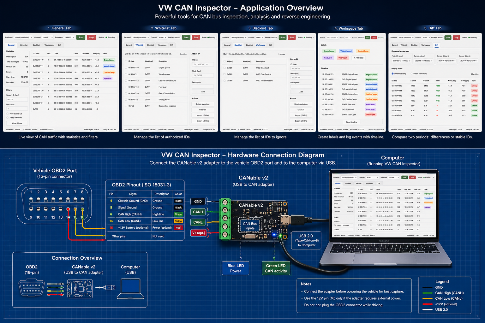

# CANBus Discovery Toolkit

An open-source starter kit to explore CAN traffic with a Canable USB v2 adapter and a desktop app. It is designed to help you discover signals on a vehicle CAN bus and prepare a later Arduino-based HUB project.

This iteration includes:
- A desktop app with a live view of CAN frames and an inspector to spot changing bytes.
- An Arduino sketch placeholder in `hardware/` to bootstrap future embedded work.



## Features

- Auto-detect Canable USB v2 (serial) with a manual Simulator option.
- Bus speed selection and a single **Sniff** toggle to start/stop capture.
- A **Live** tab with:
  - Frame table (ID, name, DLC, data, ASCII, count, rate, last seen).
  - Frame inspector (byte change heatmap + payload history).
- A **Dictionary** tab to manage named CAN IDs.

## Project Layout

- `app/` - Desktop app (Python + Tkinter).
- `app/application/` - Application services (use cases).
- `app/domain/` - Core models and dictionary storage.
- `app/adapters/` - External adapters (CAN, serial, simulator).
- `app/ui/` - Tkinter UI (window + tabs).
- `app/ui/tabs/` - Tab layouts for Live, Diff, Dictionary.
- `app/config.py` - Shared configuration constants.
- `hardware/` - Arduino sketch for later embedded integration.
- `requirements.txt` - Python dependencies.

## Quick Start

1) Install Python 3.11+.

```
# python --version
python3 -m venv venv
source venv/bin/activate
```

2) Install dependencies:

```
pip install -r requirements.txt
```

3) Run the app:

```
python -m app
```

## Using the App

1) Plug in the Canable USB v2 adapter.
2) Select the auto-detected adapter (or choose **Simulator**) from the **Device** menu.
3) Choose the bus bitrate from the **Bitrate** menu.
4) Click **Sniff** to start/stop capture.

## Arduino Serial Control (Hardware)

The Arduino sketch listens for simple serial commands so the desktop software
can set the CAN bitrate and prepare OBD requests:

- `BITRATE <bps>`: reinitialize CAN at the given bitrate (example: `BITRATE 500000`).
- `OBD <service> <pid>`: send an OBD request (example: `OBD 01 0C`).
- `OBD <service><pid>`: compact hex form (example: `OBD 010C`).
- `HELP`: print the available commands.

## Serial Console (App)

The **Live** tab includes a small serial console to talk to the Arduino board.
Select the Arduino serial port, click **Connect**, and send commands directly
from the input field.

## Diff Tab

Use the **Diff** tab to compare two capture windows:

- **Blob**: capture while you perform a specific action.
- **Minus**: capture a longer baseline window.
- **Hold Capture**: records only while the button is held down.
- **Latch Capture**: toggles recording on/off.
- **Reset** clears both lists.
- **Diff CAN ID** renders frames present in Blob but not in Minus.

## Dictionary Tab

The **Dictionary** tab lists every CAN ID that has a name assigned. Double-click
the **Name** cell to rename it or clear the name to remove it from the list.

Use the **Dict** menu to save, save as, or import a dictionary file.

### Live Tab Visuals

The **Live** tab is designed to help you quickly discover interesting signals:
- **Frame table**: summarizes each arbitration ID with counts, rate, and last seen.
- **Inspector**: select a row to see a per-byte change heatmap and a rolling payload history.
  - Bytes that change often are highlighted more strongly.
  - The history list helps spot counters, flags, or slowly changing values.

## Notes

- The app uses `python-can` with the `slcan` interface for serial adapters.
- If the adapter is not detected, use the Simulator to explore the UI and workflow.

## Roadmap (Next Iterations)

- Filters (ID ranges, byte masks, period threshold).
- Graph view for selected byte(s).
- Export to CSV/PCAP.
- Arduino HUB prototype (routing and signal decoding).

## License

MIT

